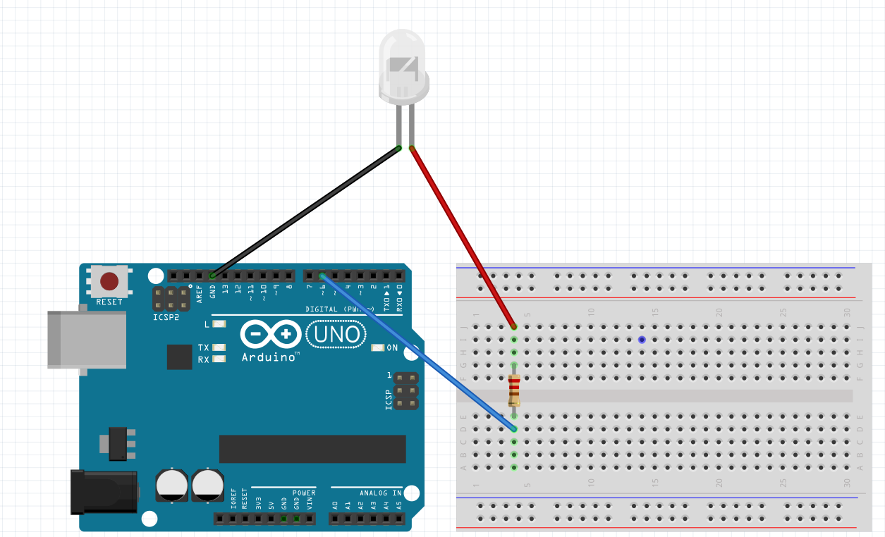

# Intermediate-Arduino

## LED Blink Revisited
#### Included Files:
<a href="LED_Blink_Revisited/LED_Blink_Revisited.ino">LED_Blink_Revisited</a>  
In this assignment I refreshed my knowledge of Arduino and learned how to use analog output through pulse width modulation. My code makes an LED gradually brighten and dim from off to full brightness. It also prints how much power is going to the LED on the serial monitor. 
  
For me, this assignment was a pleasant refresher and a good way to learn how to use a for statement.

## Hello LCD
#### Included Files:
<a href="LCD/LCD.ino">LCD</a>  
<a href="millistest/millistest.ino">millistest</a>  
In this assignment I used an LCD screen to print "hello world" and the amount of time since the code started. I used the LiquidCrystal library to make the LCD usable. One thing that I learned in this assignment was how to use the millis() function to keep time. 
 
  
I didn't enjoy this assignment due to the tedious nature of wiring the LCD screen.

## LCD Backpack
#### Included Files:
<a href="LCD_Backpack/LCD_Backpack.ino">LCD_Backpack</a>  
<a href="LCD_Backpack2/LCD_Backpack2.ino">LCD_Backpack2</a>  
In this assignment I learned how to use the LCD backpack to save the time and space of wiring. In my program a counter goes up when you press the button. For my first draft (LCD_Backpack) the counter keeps increasing even if you don't release the button. My final draft (LCD_Backpack2) uses a boolean to stop the counter from increasing until you release the button.  
  
I liked this assignment because it gave an easy solution for the problem of wiring the LCD.

## Photointerrupters
#### Included Files:
<a href="Photointerrupter/Photointerrupter.ino">Photointerrupter</a>  
<a href="interrupt_test/interrupt_test.ino">interrupt_test</a>  
In this assignment I used a photointerrupter and interrupt function to turn an LED on and off. Whenever something goes between the photointerrupter mu LED turns on and off. This happens very fast beacuse it uses an interrupt, so it stops all other code to control the LED.
  
I had a little trouble with this assignment because I hadn't done the functions assignment, so I fully understand what a function was.
## Potentiometers
#### Included Files:
<a href="Potentiometers/Potentiometers.ino">Potentiometers</a>  

## Motor Control
#### Included Files:
<a href="Motor_Control/Motor_Control.ino">Motor_Control</a>  

  
